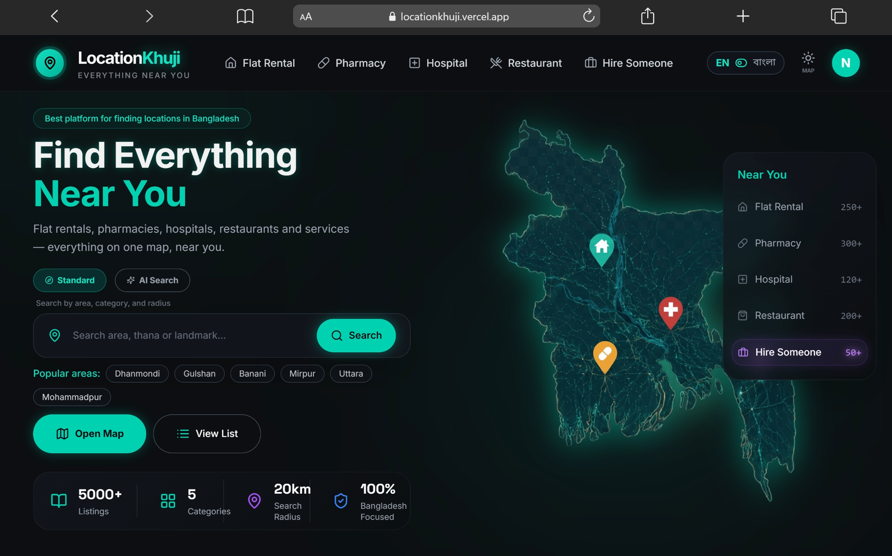
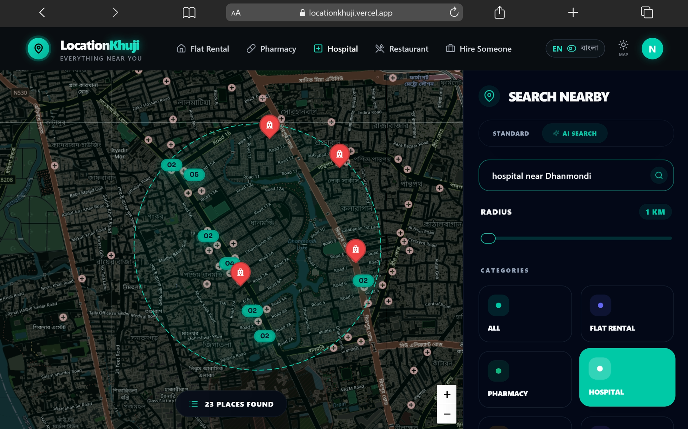
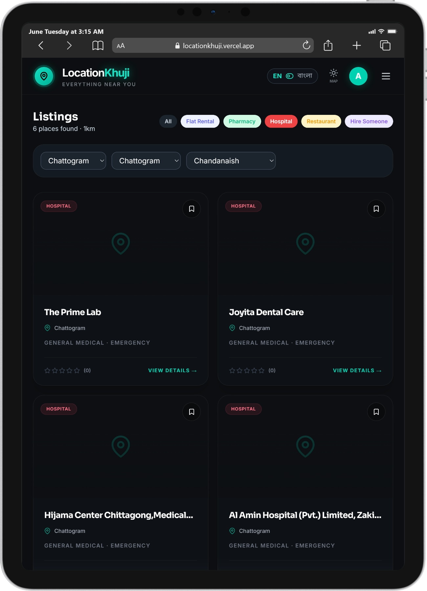
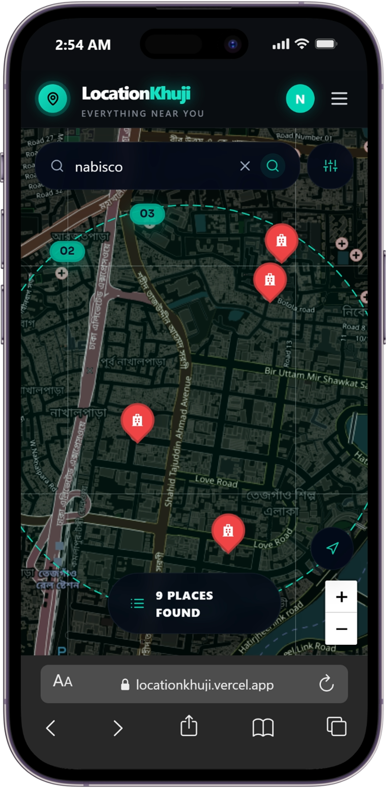

# <div align="center">🪐 LocationKhuji (লোকেশন খুঁজি)</div>

<div align="center">
  <h3>The AI-Powered Bangladesh-Centric Location Discovery & Real-Time Listings Engine</h3>
  <p><strong>লোকেশন খুঁজি</strong> is a premium, map-first location intelligence and discovery platform built exclusively for the geographic limits of Bangladesh. Combining natural language AI search, strict geospatial boundaries, and real-time synchronization, it provides a stunning, high-performance user experience.</p>
</div>

<div align="center">

[](#)
[](#)
[](#)
[](#)
[](#)
[](#)
[](#)
[](#)

</div>

---

## 📖 Project Overview

**LocationKhuji** exists to solve the challenges of location discovery in Bangladesh. Traditional mapping and listing sites are either global platforms lacking local context, or static lists of businesses with broken coordinates and outdated data. 

LocationKhuji introduces:
* **Strict Geographic Bounds:** Locked entirely within the coordinates of Bangladesh (South-West: `[20.3, 88.0]`, North-East: `[26.7, 92.7]`), preventing out-of-boundary queries.
* **Multilingual AI Search:** Users can query the database using complex natural language phrases in English, Bengali, or mixed *Banglish* (e.g., `"মিরপুর ১০ এ ডেন্টাল হাসপাতাল"` or `"pharmacy near dhanmondi 32"`).
* **Map-First Architecture:** A highly interactive, dark-mode Leaflet Map serves as the visual core, updating search pins, clustering locations, and adjusting radius indicators in real-time.
* **Automatic Live Seeding:** If local MongoDB database records are empty for a specific query, the system automatically falls back to search and parse the live **OpenStreetMap Overpass API**, deduplicating and saving new listings on-the-fly, while broadcasting them via **Socket.io**.

---

## ⚡ Key Features

* 🗺️ **Premium Map-First UI/UX:** Clean, responsive, organic glassmorphism UI optimized for dark theme / OLED screens. Custom markers and cluster animations.
* 🤖 **Waterfall AI Intent Parsing:** Under-50ms search processing using **Groq (Llama 3.3)** $\rightarrow$ falling back to **OpenRouter (DeepSeek V3)** $\rightarrow$ falling back to a robust offline local Regex Engine.
* 🇧🇩 **Bangladesh Address Intelligence Engine:** A centralized parser using local datasets (`divisions.json`, `districts.json`, `upazilas.json`) resolving English/Bangla name variants, typos, and coordinates.
* 📍 **Dynamic Radius Discovery:** Instantly recalculates and renders a dashed radius circle on the map centered on the resolved search coordinates (default 1 km).
* 🔄 **Real-Time Synchronized Broadcasts:** Emits real-time `new_listing` events via **Socket.io** so active map instances immediately receive and render newly seeded listings.
* 🎛️ **Hierarchical Filters:** Advanced location selectors (Division $\rightarrow$ District $\rightarrow$ Thana) built exclusively inside the Listings Page for targeted discovery.
* 📷 **Cloud-Hosted Asset Pipeline:** Multer and Cloudinary integration for streaming secure listing image uploads with automatic FileRecord logging.
* 🔒 **Dev-Mode Bypass & Guards:** Easy local onboarding with mock user generation and custom Firebase Dev JWT tokens.
* 📱 **Mobile-First Responsiveness:** Fully adapted interface supporting fluid touch panning, clustered marker taps, and collapsible sidebars.

---

## 🖼️ Screenshots

<div align="center">
  <table border="0">
    <tr>
      <td width="50%">
        <p align="center"><strong>Desktop Map Interface</strong></p>
        
      </td>
      <td width="50%">
        <p align="center"><strong>AI Multilingual Search</strong></p>
        
      </td>
    </tr>
    <tr>
      <td width="50%">
        <p align="center"><strong>Listings Directory & Filters</strong></p>
        
      </td>
      <td width="50%">
        <p align="center"><strong>Mobile Search Layout</strong></p>
        
      </td>
    </tr>
  </table>
</div>

---

## 🛠️ Tech Stack

LocationKhuji is organized as an **npm workspaces monorepo** with decoupled backend and frontend environments:

| Layer | Technologies | Key Features |
| :--- | :--- | :--- |
| **Frontend** | React 19, CRACO, Zustand 5, Axios, TailwindCSS 3, Framer Motion 12 | State stores, smooth CSS keyframes, interactive Leaflet integration, i18next translation |
| **Backend** | Node.js (v18+), Express.js 4, Mongoose 8, Socket.io 4, Multer | GeoJSON indexes, background OSM parsing, WebSocket push triggers |
| **AI & Geocoding** | Groq (Llama 3), OpenRouter (DeepSeek V3), OSM Nominatim | AI intent extraction, caching layers, spatial keyword resolution |
| **Infrastructure** | Vercel, Render Free Web Services, MongoDB Atlas, Cloudinary CDN, UptimeRobot | Production hosting, database cloud clusters, keep-alive warmups |

---

## 📐 System Architecture & Search Flow

The backend handles incoming requests through a multi-stage search engine:

```text
                  User Search Query (English / Bangla / Banglish)
                                       │
                                       ▼
                       Stage 1: Local Name Normalization
                       (Cleans grammar, maps Bengali digits)
                                       │
                                       ▼
                     Stage 2: Waterfall AI Intent Parsing
                      ┌─────────────────────────────────┐
                      │ 1. Primary: Groq (Llama 3)      │
                      │ 2. Fallback: OpenRouter         │
                      │ 3. Offline: Local Regex Engine  │
                      └────────────────┬────────────────┘
                                       │
                                       ▼
                  Stage 3: Central BD Location Engine Lookup
                (Matches Divisions, Districts, Upazilas/Thanas)
                                       │
                                       ▼
                  Stage 4: MongoDB Geospatial Query ($nearSphere)
                                       │
                 ┌─────────────────────┴─────────────────────┐
                 ▼ (If Listings Found)                       ▼ (If Empty Results)
       Return Local DB Results                      Query OSM Overpass API
                 │                                           │
                 │                                           ▼
                 │                                Parse & Deduplicate (100m)
                 │                                           │
                 │                                           ▼
                 │                                Seed Listings to MongoDB
                 │                                           │
                 │                                           ▼
                 │                                 Emit Socket.io Broadcast
                 │                                           │
                 └─────────────────────┬─────────────────────┘
                                       ▼
                            Leaflet Map Rendering
                         (Fly-to bounds, update radius)
```

---

## 🇧🇩 Bangladesh Location Intelligence

Instead of sending every request to expensive geocoding APIs, LocationKhuji uses a custom [BDLocationEngine](file:///d:/LocationKhuji/packages/shared-config/bd-location-engine.js) mapping local configuration datasets:

* **Authoritative Data Maps:** Loads [divisions.json](file:///d:/LocationKhuji/packages/shared-config/data/divisions.json), [districts.json](file:///d:/LocationKhuji/packages/shared-config/data/districts.json), and [upazilas.json](file:///d:/LocationKhuji/packages/shared-config/data/upazilas.json).
* **Multilingual Mapping:** The engine translates names seamlessly (e.g. `Dhaka` $\leftrightarrow$ `ঢাকা`, `Chittagong` $\leftrightarrow$ `চট্টগ্রাম`) and resolves spelling deviations.
* **Bengali Numeral Normalization:** Automatically converts Bengali integers to standard numerals (e.g. `মিরপুর ১০` $\rightarrow$ `mirpur 10`) to safeguard database queries.
* **Geospatial Coordinate Binding:** Maps have hardcoded bounding targets matching Bangladesh's geographic bounds. If a coordinate is outside this grid, listing creation is rejected.

---

## 🤖 AI Search Pipeline

When submitting an AI search, the endpoint `/api/listings/ai-search` processes intent using a strict waterfall pattern:

1. **Groq Llama 3 API:** Attempts to parse query parameters under 50ms into a structured JSON schema containing category, keywords, price range, and location markers.
2. **OpenRouter DeepSeek V3:** Invoked automatically if the primary Groq service encounters rate limits (HTTP 429) or is down.
3. **Smart Offline Regex:** Parses standard structures if no network keys are present, ensuring search reliability offline.

The returned response formats the query variables cleanly:
```json
{
  "category": "flat|pharmacy|hospital|restaurant|service",
  "keywords": ["balcony", "generator"],
  "isEmergency": false,
  "maxPrice": null,
  "bedrooms": null,
  "location": "Mirpur 10"
}
```

---

## 📂 Folder Structure

```text
LocationKhuji/
├── package.json                 # Root npm workspaces configuration
├── apps/
│   ├── backend-api-gateway/     # Node.js + Express API Monolith
│   │   ├── package.json         # name: "locationkhuji-backend"
│   │   ├── render.yaml          # Render service deployment setup
│   │   └── src/
│   │       ├── server.js        # Server initialization and routes
│   │       ├── locationResolver.js # Geocoding fallback logic
│   │       ├── seed_osm.js      # OpenStreetMap seeding scripts
│   │       └── scripts/         # Database migrations and normalizers
│   └── frontend-search-hub/     # React 19 Client SPA
│       ├── package.json         # name: "frontend"
│       ├── craco.config.js      # Webpack alias overrides (@/* -> src/*)
│       ├── tailwind.config.js   # Tailwind configurations and tokens
│       └── src/
│           ├── App.js           # Route layout definitions
│           ├── index.css        # Glassmorphism design tokens & styles
│           ├── components/      # MapView, ListingCard, and UI Primitives
│           ├── pages/           # MapPage, ListPage, DetailPage, Dashboard
│           ├── store/           # Zustand global state (auth, map, theme)
│           └── locales/         # i18next English and Bengali files
└── packages/
    └── shared-config/           # Monorepo shared libraries
        ├── index.js             # Export entrypoint
        ├── bd-location-engine.js# Centralized Bangladesh Location Engine
        └── data/                # Pre-cached JSON administrative maps
```

---

## 💻 Installation & Local Development

### Prerequisites
* **Node.js** (v18 or higher recommended)
* **MongoDB** (Local instance or Atlas cloud cluster URI)
* **Firebase Project** (For authentication setup)

### 1. Clone the Repository
```bash
git clone https://github.com/fardinhossain/LocationKhuji.git
cd LocationKhuji
```

### 2. Install Workspace Dependencies
Use npm workspaces to install dependencies across the monorepo from the root folder:
```bash
npm install
```

### 3. Setup Environment Variables
Configure your environment files based on the project templates.

* Create `apps/backend-api-gateway/.env`
* Create `apps/frontend-search-hub/.env`

*(See the [Environment Variables](#-environment-variables) section below for keys).*

### 4. Run the Development Servers
Launch both the backend and frontend servers concurrently from the root directory:

```bash
# Start backend API (Port 8001)
npm run dev:api

# Start frontend development server (Port 3000)
npm run dev:hub
```

---

## 🔑 Environment Variables

### Backend Environment Configuration (`apps/backend-api-gateway/.env`)

| Key | Description | Example Value |
| :--- | :--- | :--- |
| `PORT` | Local server port | `8001` |
| `MONGODB_URI` | MongoDB Connection URL | `mongodb+srv://...` |
| `CORS_ORIGIN` | Allowed client URL | `http://localhost:3000` |
| `GROQ_API_KEY` | Groq Console API Credentials | `gsk_xxxx...` |
| `OPENROUTER_API_KEY` | OpenRouter Fallback Key | `sk-or-v1-xxxx...` |
| `CLOUDINARY_CLOUD_NAME` | Cloudinary storage identifier | `wpauaxoh` |
| `CLOUDINARY_API_KEY` | Cloudinary API Key | `884553658586671` |
| `CLOUDINARY_API_SECRET` | Cloudinary API Secret | `xxxx...` |
| `FIREBASE_PROJECT_ID` | Firebase administration project ID | `locationkhuji` |
| `FIREBASE_SERVICE_ACCOUNT_JSON`| Firebase service account JSON | `{"type": "service_account", ...}` |

### Frontend Environment Configuration (`apps/frontend-search-hub/.env`)

| Key | Description | Example Value |
| :--- | :--- | :--- |
| `REACT_APP_BACKEND_URL` | Live backend API address | `http://localhost:8001` |
| `REACT_APP_FIREBASE_API_KEY` | Firebase Client Web Key | `AIzaSy...` |
| `REACT_APP_FIREBASE_PROJECT_ID` | Firebase Project Target ID | `locationkhuji` |

---

## 🚀 Deployment

The project is structured for easy deployment to cloud services:

```text
Frontend Component  ──►  Vercel
Backend API         ──►  Render (Free Tier Web Service)
Database Cluster    ──►  MongoDB Atlas
Media Storage       ──►  Cloudinary
Warmup Ping Service ──►  UptimeRobot (Pings /api/health)
```

### Deploying Frontend (Vercel)
1. Import the repository on Vercel.
2. Select `apps/frontend-search-hub` as the Root Directory.
3. Configure the environment variables shown above.
4. Set Framework Preset to **Create React App**. Click **Deploy**.

### Deploying Backend (Render)
1. Add a new **Web Service** pointing to your repository on Render.
2. Set the Root Directory to `apps/backend-api-gateway`.
3. Add your backend environment variables.
4. Set the build command to `npm install` and start command to `npm start`.

### Bypassing Render Free Tier Cold Starts
To keep your backend service running and prevent delays on the first search:
1. Go to [UptimeRobot](https://uptimerobot.com).
2. Create an **HTTP(s)** monitor pointing to `https://your-backend.onrender.com/api/health`.
3. Set the monitoring interval to **5 minutes**.

---

## 📱 Mobile Optimization

LocationKhuji features a responsive layout designed for mobile devices in Bangladesh:
* **Gesture Locks:** Map scroll gestures are configured to prevent standard page scroll conflicts on smaller touch screens.
* **Touch-Friendly Targets:** Markers cluster dynamically, expanding on click for easy selection.
* **Responsive Sidebar:** Collapse or expand search panels to maximize screen space.

---

## ⚡ Performance Optimizations

* **List Virtualization:** The Listings sidebar uses virtual rendering, rendering only the visible items. This keeps page navigation smooth even when displaying thousands of search results.
* **Geospatial Indexing:** The MongoDB collection features a `2dsphere` index on listing coordinates to handle spatial queries quickly.
* **Memory Caching:** Intent requests and Nominatim geocoder queries are cached locally to reduce API wait times.

---

## 🔒 Security

* **Backend Key Isolation:** Credentials for Groq, OpenRouter, and Firebase admin keys are isolated on the backend.
* **Strict CORS Whitelist:** The backend enforces CORS restrictions, allowing requests only from configured client domains.
* **Firebase Token Security:** Backend endpoints verify authentication headers using Firebase Admin JWT validation.

---

## 🗺️ Roadmap

- [ ] **AI Assistant Chatbot:** Interactive map agent to help users find flats or nearby amenities using conversational prompts.
- [ ] **Push Notification Updates:** Socket-driven updates warning users of new emergency services listing in their area.
- [ ] **Advanced Owner Analytics:** Dashboards for business owners to track listing views and search metrics.
- [ ] **Mobile App:** Native client app built using React Native.

---

## 🤝 Contributing

We welcome contributions to LocationKhuji! 

1. Fork the repository.
2. Create a new branch: `git checkout -b feature/your-feature-name`.
3. Commit your changes: `git commit -m "feat: add some feature"`.
4. Push to your branch: `git push origin feature/your-feature-name`.
5. Open a Pull Request.

---

## 📄 License

This project is licensed under the MIT License - see the [LICENSE](LICENSE) file for details.

---

## 👥 Authors

Developed with ❤️ by **Fardin** | **NovoSoft.AI**

* **GitHub:** [@fardinhossain](https://github.com/fardinhossain)
* **LinkedIn:** [Fardin Hossain](https://linkedin.com/in/fardinhossain)
* **Email:** support@novosoft.ai
